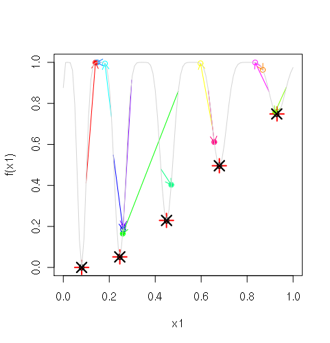
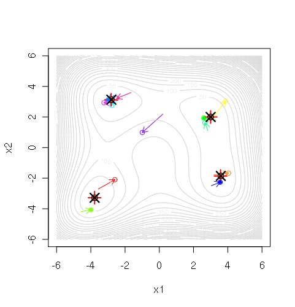
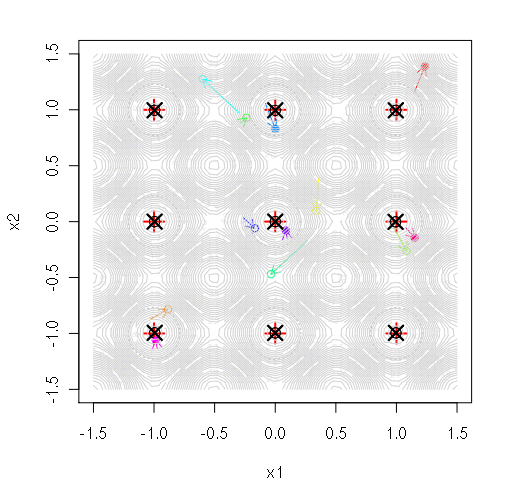
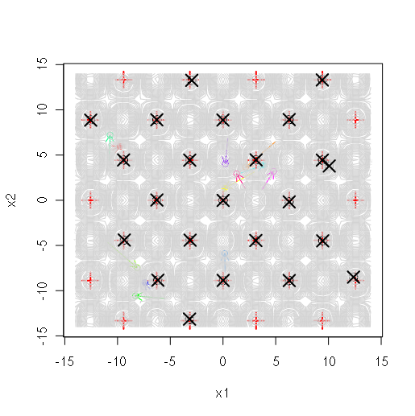

# Prerequisite R packages

The `ispso.R` script requires two packages directly and these dependency packages may need additional packages to be installed. You need to install the **fOptions** and **plotrix** packages.

`ispso` takes quasi-random samples from the problem space. The **fOptions** package provides the `runif.sobol` function, which takes Sobol' sequences [@{Sobol'.1967}] scrambled by the Owen and Faure-Tezuka scrambling schemes [@Owen.1998; @Faure.Tezuka.2002].

`ispso` can optionally draw a real-time $f(x)$--$x$ plot for 1-dimensional problems defined as $f(x)$, where $x$ is an input variable. If the problem dimension is higher than 1, the user can specify any two axes $x_i$ and $x_j$, and `ispso` draws contour lines of the objective function, $f(\vec{x})$, projected to the $x_i$--$x_j$ surface. The real-time plot visualizes how particles are moving around in the problem space. As particles find a new solution (termed as nest), `ispso` draws a circle at the new nest using the `draw.arc` function provided by the **plotrix** package.

# What is in the package?

Included in the ISPSO package are three R script files (`ispso.R`, `funcs.R`, and `test.R`) and one PDF file (`ispso.pdf`, which you're reading now). `ispso.R` defines the main function `ispso`, `funcs.R` defines various test functions, and `test.R` provides example runs.

# `ispso`: Main function

`ispso` takes one parameter named `s`. The other two parameters `pop` and `nest` are used only for debugging purposes and this document does not discuss these parameters. `ispso` returns an output list, which will be called `ret` in this document for convenience. In the R prompt, you can type `ret <- ispso(s)` to start optimization.

## `s`: Input list

The `s` parameter is a list that contains all the user variables that `ispso` uses to determine how particles will move, when they will be nested, and when optimization will stop.

`s$f`

:   An objective function $f(\vec{x})$ to optimize that takes one double-type vector $\vec{x}$ as an input and returns a double as an output. The output of the function is referred to as an objective function value or fitness value. For testing purposes, `s$f` can optionally take the second boolean-type parameter whose default value is FALSE. If this parameter is FALSE, `s$f` returns an objective function value as usual. However, if this parameter is TRUE, `s$f` returns a matrix that contain true solutions. For real-world problems, this second parameter may not be defined because true solutions are usually not known.

`s$D`

:   The dimension $D$ of the input vector of $f(\vec{x})$. $D=|\vec{x}|$.

`s$xmin`

:   A double-type vector containing the minimum values of the input vector elements. $\vec{x}_\text{min}=\{x_{i,\text{min}}\,|\,x_{i,\text{min}}=\min(x_i)\}$ and $|\vec{x}_\text{min}|=D$.

`s$xmax`

:   A double-type vector containing the maximum values of the input vector elements. $\vec{x}_\text{max}=\{x_{i,\text{max}}\,|\,x_{i,\text{max}}=\max(x_i)\}$ and $|\vec{x}_\text{max}|=D$.

`s$vmax`

:   The maximum velocity of particles ($D$-dimensional vector). Between two consecutive iterations, particles are not allowed to move further than the maximum velocity in each axis.

`s$vmax0`

:   The maximum speed of new particles (scalar). New particles are not as fast as old ones.

`s$S`

:   The swarm size $|S|$. There will be exactly $|S|$ particles during optimization.

`s$c1`

:   *Optional.* Default value: 2.05. The cognitive coefficient $\psi_1$.

`s$c2`

:   *Optional.* Default value: 2.05. The social coefficient $\psi_2$.

`s$w`

:   *Optional.* Default value: $\chi=\dfrac{2}{\left|2-\psi-\sqrt{\psi^2-4\psi}\right|}$ where $\psi=\psi_1+\psi_2>4$. The constriction factor $\chi$ [@Clerc.1999].

`s$rspecies`

:   The species radius $r_\text{species}$. Particles within distance $r_\text{species}$ from a species seed form a species and share information.

`s$rprey`

:   The prey radius $r_\text{prey}$. Fitness assimiliation will happen if inferior particles approach a superior particle within distance $r_\text{prey}$.

`s$rnest`

:   The nest radius $r_\text{nest}$. Once a solution---referred to as a nest---is found, no particles are allowed to approach the existing nest if they are within distance $r_\text{nest}$ from the nest.

`s$age`

:   The age threshold $a$. The experience of particles younger than the age threshold $a$ is not trusted and those particles cannot nest.

`s$xeps`

:   The threshold value $\epsilon_x$ for the normalized geometric mean. If the normalized geometric mean of a particle's past halflife trajectory is smaller than or equal to $\epsilon_x$, one criterion for nesting is considered satisfied.

`s$feps`

:   The threshold value $\epsilon_f$ for the standard deviation of a particle's past halflife fitness values. If the standard deviatoin of a particle's past halflife fitness values is smaller than or equal to $\epsilon_f$, another criterion for nesting is considered satisfied. If the $a$, $\epsilon_x$, and $\epsilon_f$ thresholds are all satisfied, a solution or nest is added.

`s$exclusion_factor`

:   The exclusion factor $f_E$. One of the challenges that multi-modal optimizers face is that it is not straightforward to determine when to stop optimization earlier than a pre-defined maximum number of iterations. The more global and local minima are found, the more frequently exclusion happens because there will be more and more nests. The exclusion factor is used to define on average how many exclusions per nest need to happen before optimization stops. If the exclusion factor is not defined, this criterion is not used for stopping.

`s$maxiter`

:   The maximum number of iterations. Optimization can stop earlier if the exclusion factor criterion is met first.

`s$.deterministic`

:   *Optional.* Default value: `FALSE`. `ispso` generates psuedo-random numbers and Sobol' sequences for particle movement and speciation. By default, these numbers are randomly generated. If you want to run `ispso` deterministically by starting from a default state (no previous runs) or restarting from the previous state, set `s$.deterministic` to `TRUE`. If you have run `ispso` before and R saved the last state, you can replay the previous run by setting it to `TRUE`.

`s$.plot_method`

:   *Optional.* Default value: `"movement"`.

    `""`

    :   No plot.

    `"movement"`

    :   Shows particle movement one iteration at a time.

    `"movement,species"`

    :   Shows particle movement with speciation circles.

    `"density"`

    :   Shows accumulated particle locations.

    `"profile"`

    :   Shows the number of nests versus the number of function evaluations.

    `"diversity"`

    :   Shows diversity in the current iteration versus the number of iterations. Diversity is defined as $\dfrac{\sum_{i=1}^{|S|}\sqrt{\sum_{d=1}^D\left(x_{i,d}-\overline{x_d}\right)^2}}{|S|}$, where $x_{i,d}$ is the coordinate in axis $d$ of particle $i$ and $\overline{x_d}$ is the mean coordinate in axis $d$ of all the particles in the current iteration.

    `"mean_diversity"`

    :   Shows the mean diversity versus the number of iterations. The mean diversity is the average of all the diversities until the current iteration.

`s$.plot_x`

:   *Optional.* Default value: texttt1:2. Only applies when $D>1$. Two axes to plot. If $D=1$, $f(x_1)$ versus $x_1$ is always plotted.

`s$.plot_delay`

:   *Optional.* Default value: `0`. Delay in seconds between plots.

`s$.plot_distance_to_solution`

:   *Optional.* Default value: 0.05. Only applies when $f(\vec{x})$ implements the optional boolean-type parameter that allows the function to return true solutions. Because true solutions are known, `ispso` can draw circles at the known solutions to show how well optimization is performing. This option specifies the radius in a fraction of the diagonal length of the search space or $\sqrt{\sum_{i=1}^D\left(x_{i,\text{max}}-x_{i,\text{min}}\right)^2}$.

`s$.plot_save_prefix`

:   *Optional.* Default value: `""`. The prefix of plot files. If this option is specified, a PNG file will be saved at every iteration.

`s$.stop_after_solutions`

:   *Optional.* Default value: 0. Only applies when $f(\vec{x})$ implements the optional boolean-type parameter that allows the function to return true solutions. Because true solutions are known, `ispso` can determine whether or not it found all the solutions. If there are too many solutions, `ispso` can decide to stop early without finding them all. This option species the number of solutions that `ispso` need to find before stopping. If this option is 0, other criteria need to be met and this option is ignored.

## `ret`: Output list

You can assign the output of `ispso` to a variable with any name, but, in this document, a variable name `ret` is used for convenience.

`ret$iter`

:   The number of iterations `ispso` performed.

`ret$evals`

:   The number of function evaluations `ispso` performed.

`ret$nest`

:   Nests that `ispso` found. This output is a matrix that contains all the nests found. The matrix has columns named `x1`...`x`*D*, `f`, `v`, `age`, and `evals`, where *D* is the problem dimension, `x1`...`x`*D* are the coordinates of the nest, `f` is the objective function value, `v` and `age` are the final velocity and age of the particle, respectively, and `evals` is the number of function evaluations required to find the nest. Each row of the matrix represents one nest `ispso` found and the number of rows is the same as the number of nests.

`ret$pop`

:   Population or all the particle positions that `ispso` evaluated. This output is a matrix that contains all the particle positions that `ispso` evaluated during optimization. The matrix has columns named `x1`...`x`*D*, `f`, `v`, and `age`, where *D* is the problem dimension, `x1`...`x`*D* are the coordinates of the particle, `f` is the objective function value, and and `are` are the velocity and age of the particle, respectively. Since this matrix contains all the particle positions, `ret$pop[0:(ret$iter-1)*s$S+`$i$`,]` will return the trajectory of particle $i$.

# Examples

## 1-dimensional function

$$F4(x)=1-\exp\left(-2\log(2)\cdot\left(\frac{x-0.08}{0.854}\right)^2\right)
    \cdot\sin^6\left(5\pi(x^{3/4}-0.05)\right).$$

    source("ispso.R")
    source("funcs.R")
    s <- list()
    s$f <- f4
    s$D <- 1
    s$xmin <- 0
    s$xmax <- 1
    s$S <- 10 + floor(2*sqrt(s$D))
    s$vmax <- (s$xmax-s$xmin)*0.1
    s$vmax0 <- diagonal(s)*0.001
    s$exclusion_factor <- 3
    s$maxiter <- 200
    s$xeps <- 0.001
    s$feps <- 0.0001
    s$rprey <- diagonal(s)*0.0001
    s$age <- 10
    s$rspecies <- diagonal(s)*0.1
    s$rnest <- diagonal(s)*0.01
    ret <- ispso(s)

{width="60%"}

## Himmelblau function

$$F5(x_1, x_2)=(x_1^2+x_2-11)^2+(x_1+x_2^2-7)^2.$$

    source("ispso.R")
    source("funcs.R")
    s <- list()
    s$f <- himmelblau
    s$D <- 2
    s$xmin <- rep(-6, s$D)
    s$xmax <- rep(6, s$D)
    s$S <- 10 + floor(2*sqrt(s$D))
    s$vmax <- (s$xmax-s$xmin)*0.1
    s$vmax0 <- diagonal(s)*0.001
    s$exclusion_factor <- 3
    s$maxiter <- 200
    s$xeps <- 0.001
    s$feps <- 0.0001
    s$rprey <- diagonal(s)*0.0001
    s$age <- 10
    s$rspecies <- diagonal(s)*0.1
    s$rnest <- diagonal(s)*0.01
    s$.plot_distance_to_solution <- 0.01
    ret <- ispso(s)

{width="60%"}

## Rastrigin function

$$F6(\vec{x})=\sum_{i=1}^D\left[x_i^2-10\cos(2\pi x_i)+10\right].$$

    source("ispso.R")
    source("funcs.R")
    s <- list()
    s$f <- rastrigin
    s$D <- 2
    s$xmin <- rep(-1.5, s$D)
    s$xmax <- rep(1.5, s$D)
    s$S <- 10 + floor(2*sqrt(s$D))
    s$vmax <- (s$xmax-s$xmin)*0.1
    s$vmax0 <- diagonal(s)*0.001
    s$exclusion_factor <- 3
    s$maxiter <- 200
    s$xeps <- 0.001
    s$feps <- 0.0001
    s$rprey <- diagonal(s)*0.0001
    s$age <- 10
    s$rspecies <- diagonal(s)*0.1
    s$rnest <- diagonal(s)*0.01
    s$.plot_distance_to_solution <- 0.01
    ret <- ispso(s)

{width="60%"}

## Griewank function

$$F7(\vec{x})=
    \frac{1}{4000}\sum_{i=1}^2x_i^2
    -\prod_{i=1}^2\cos\left(\frac{x_i}{\sqrt{i}}\right)+1$$

Because the Griewank function has an exponentially growing number of minima with increasing dimensions [@Cho.ea.2008], it is fairly difficult to find all minima. In a statistical test using `ispso` and the Griewank function [@Cho.2008], it took $11,455\pm 1,252$ function evaluations to find $98.06\pm 2.26\%$ of all the minima of the 2-dimensional Griewank funciton within $[-14,\,14]^2$. You need a lot more iterations compared to other functions to find more minima.

    source("ispso.R")
    source("funcs.R")
    s <- list()
    s$f <- griewank
    s$D <- 2
    s$xmin <- rep(-14, s$D)
    s$xmax <- rep(14, s$D)
    s$S <- 10 + floor(2*sqrt(s$D))
    s$vmax <- (s$xmax-s$xmin)*0.1
    s$vmax0 <- diagonal(s)*0.001
    s$maxiter <- 2000
    s$xeps <- 0.001
    s$feps <- 0.0001
    s$rprey <- diagonal(s)*0.0001
    s$age <- 10
    s$rspecies <- diagonal(s)*0.1
    s$rnest <- diagonal(s)*0.01
    s$.plot_distance_to_solution <- 0.01
    ret <- ispso(s)

{width="60%"}

# Applications

ISPSO has successfully been applied to the optimization of the Soil and Water Assessment Tool (SWAT), a hydrologic and environmental model, [@Cho.2008] and the Modified Barlett-Lewis Rectangular Pulse (MBLRP) model, a stochastic rainfall generator, [@Cho.ea.2011].

[^1]: CITATION: Cho, Huidae, Kim, Dongkyun, Olivera, Francisco, Guikema, Seth D., 2011. Enhanced Speciation in Particle Swarm Optimization for Multi-Modal Problems. European Journal of Operational Research 213 (1), 15--23.
